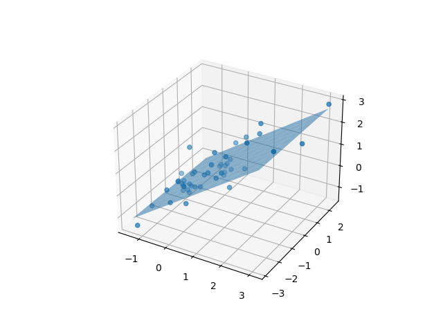

# 俱乐部任务：多变量回归

实现了小批量梯度下降、提前退出机制、任意数量参数的线性回归模型

效果如下（数据标准化之后）：

### 代码如下

  
[点击展开代码] 

    import pandas as pd
    import numpy as np
    import matplotlib.pyplot as plt
    from mpl_toolkits.mplot3d import Axes3D
    fpath = "C:/Users/15726/Desktop/JNAIC/8th/ex1data2.txt"
    datas = pd.read_csv(fpath,sep=",",header=None,names=['squares','rooms','prices'])

    class model:
        def __init__(self,num_of_w):
            self.w = np.random.randn(num_of_w,1)
            self.b = 1
            self.predict = np.array(0)
            self.prelos = 10
            self.los = 10
            self.delta_los = 1
        def forward(self,inputs):
            self.predict = np.dot(inputs, self.w) + self.b

        def backward_and_get_deltaLos(self,prices,a):
            error = prices - self.predict
            adjust_w = (error * inputs * a).mean(axis = 0) #J = (w1*s + w2*r +b - y)^2
            self.w += adjust_w[np.newaxis,:].T
            self.b += error.mean(axis = 0)

            self.prelos = self.los
            self.los = (error*error).mean()
            self.delta_los = self.prelos - self.los

        def train(self,inputs,rights,a):
            self.forward(inputs)
            self.backward_and_get_deltaLos(rights,a)
        def losSmallEnough(self,lim):
            if self.delta_los < lim:
                return True

    datas['squares'] = (datas['squares'] - datas['squares'].mean())/datas['squares'].std()
    datas['rooms'] = (datas['rooms'] - datas['rooms'].mean()) / datas['rooms'].std()
    datas['prices'] = (datas['prices'] - datas['prices'].mean()) / datas['prices'].std()

    model_2param = model(2)

    batch = 5
    a = 0.001
    lim = 0.0000001

    datasize = len(datas['squares'])
    inputsdata = np.zeros((2 * datasize,2))
    inputsdata[:datasize,0] = datas['squares']
    inputsdata[datasize:,0] = datas['squares']
    inputsdata[:datasize,1] = datas['rooms']
    inputsdata[datasize:,1] = datas['rooms']

    prices = np.zeros((2 * datasize,1))
    prices[:datasize,0] = datas['prices']
    prices[datasize:,0] = datas['prices']

    for e in range(1000):
        for i in range(0,datasize,batch):
            inputs = inputsdata[i:i+batch,:]
            rights = prices[i:i+batch,:]
            model_2param.train(inputs,rights,a)
        if model_2param.losSmallEnough(lim):
            break

    fig = plt.figure()
    pic = fig.add_subplot(111,projection = '3d')
    pic.scatter(datas['squares'],datas['rooms'],datas['prices'])

    w1 = model_2param.w[0,0]
    w2 = model_2param.w[1,0]

    x = np.linspace(min(datas['squares']), max(datas['squares']), 10)
    y = np.linspace(min(datas['rooms']), max(datas['rooms']), 10)
    x, y = np.meshgrid(x, y)
    z = w1 * x + w2 * y + model_2param.b
    pic.plot_surface(x, y, z, alpha=0.5)

    plt.savefig('C:/Users/15726/Desktop/JNAIC/周报/第八周周报/image.png')
    plt.show()

-----

-----

### 其他
继续学习C++与win32api

 - 了解了c++类的继承
 - 了解了成员函数的const、noexcept、override特性
 - 了解了虚函数与动态绑定
 - 了解了windows的消息处理机制并正在学习windows的窗口框架