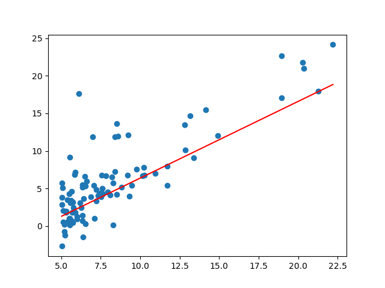

# C语言
BV1XZ4y1S7e1

13.1.3 ~ 14.2.6

# 算法题：
- 不同路径Ⅱ
- 三角形最小路径和
- 下降路径最小和
- 最大正方形
- 最长回文子串

# 线性回归

  
代码 

    import pandas as pd
    import numpy as np
    import matplotlib.pyplot as plt
    fpath = "C:/Users/15726/Desktop/JNAIC/test_task/ex1data1.txt"
    datas = pd.read_csv(fpath,sep=",",header=None,names=['population','profit'])
    def plot(w,b):
        x = np.linspace(datas['population'].min(), datas['population'].max(),30)
        y = w*x+b
        plt.plot(x,y,color = "red")
    def train(x, y,a):
        global w,b
        w += (y- w*x-b)*x*a
        b += (y- w*x-b)*a

    w = 1
    b = -1
    a = 0.001

    for e in range(1000):
        for i in range(len(datas)):
            train(datas['population'][i],datas['profit'][i],a)

    x = datas['population']
    y = datas['profit']
    plt.scatter(x,y)
    plot(w,b)
    plt.show()
    print(w,b)

 
